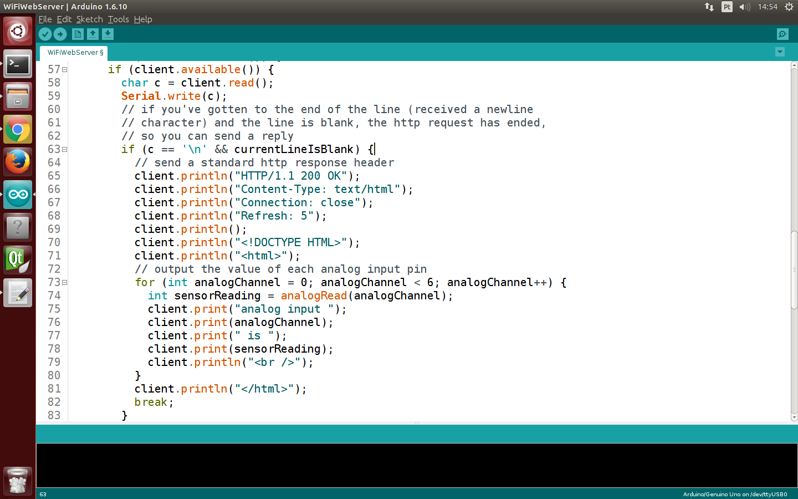
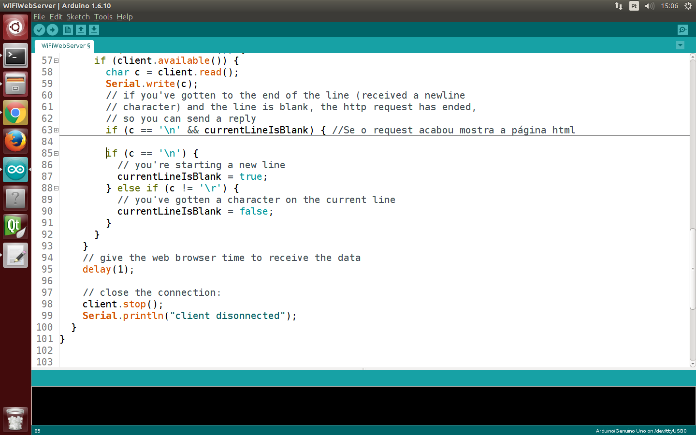
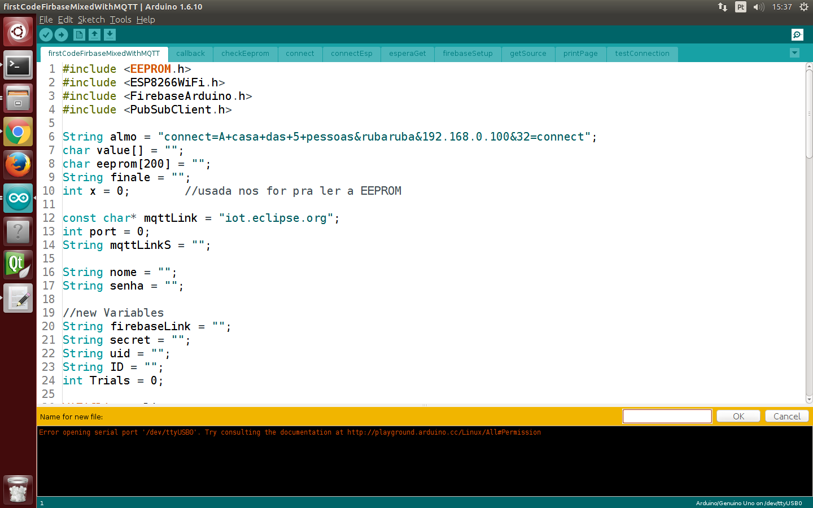
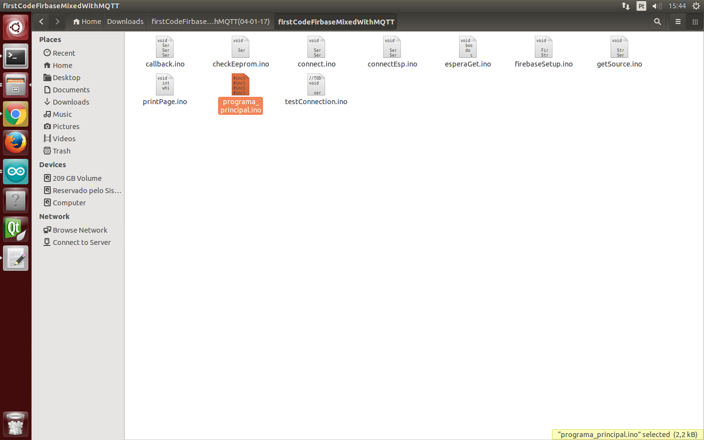
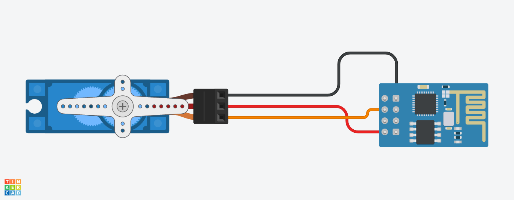
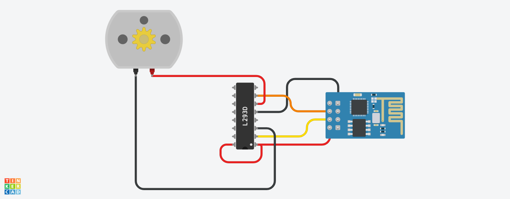

= Funções na IDE do Arduino
Luiz Felipe Santana de Araújo Souza <luizfelipeplm@gmail.com>
:listing-caption: Listing
:toc: left
:icons: font
:source-highlighter: highlightjs

== Introdução

* O uso de funções em códigos facilita muito a vida do programador. Utilizando corretamente o código fica mais organizado e consequentemente mais compreensível. É possivel reaproveitar um conjunto de linhas de códigos várias vezes evitando repetições excessivas, e, imaginando um futuro reparo no código, é possivel realizá-lo diretamente na função ao invés de alterar em cada momento que aqueles comandos foram utilizados.
Possuindo noção de sua utilidade é possivel definir uma função como:

====
Conjunto de comandos agrupados em um bloco, que recebe um nome e através deste pode ser evocado.
====

== Definindo uma função
* A seguinte sintaxe é necessária para utilizar uma função:

[source,c++]
.luiz.c
----
tipo_da_funcao  nomeDaFuncao (Lista_de_Parametros){
	// coloque aqui o conjunto de códigos que serão
    // executados quando a função for chamada
}
----

Serão mostrados a seguir 2 principais "tipos" de funções: Funções sem retorno e funções com retorno.

=== Funções sem retorno

* Quando é não é esperado que a função retorne nenhuma informação para onde ela foi chamada usamos funções sem retorno, sendo utilizado o tipo void. Um exemplo muito comum são as funções setup() e loop() presentes em qualquer código para arduino.

[source,c++]
.sem_retorno.ino
----
// Executam o codigo dentro do seu corpo
// mas nao retornam nenhum dado

void setup()
{
  // Lembrando que o setup() é executado somente uma vez.
}

void loop()
{
  // E o loop se repete quando o programa acaba.
}
----

=== Funções com retorno

* Uma função também pode retornar um resultado à parte do programa que a chamou, para isso a função deve ser do tipo da variável que vai retornar. É possível também fornecer valores para as funções sobre os quais a função deve operar. Para definir os parâmetros de uma função o programador deve explicitá-los como se estive declarando uma variável na Lista_de_Parametros, conforme mostrado em luiz.ino.
Observe o código abaixo:

[source,c++]
.com_retorno.ino
----
void setup(){
  Serial.begin(9600);
}

void loop() {
  int i = 2;
  int j = 3;
  int k;

  k = mult(i, j); // mult retornou 6 para a variavel k
  Serial.println(k);
  delay(500);
}

int mult(int x, int y){
  int result;
  result = x * y;
  return result;
}
----
== Facilidades da Arduino IDE na organização de código

* Conforme vamos escrevendo mais linhas de código, mais difícil vai ficando de compreender-lo totalmente. A organização do código é fundamental para a elaboração de programas, ainda que esta não tenha efeito sobre a execução do programa. Pensando no código como uma série de instruções, quando elas estão claras e bem definidas você, programador, consegue perceber falhas ou deficiências no seu código. Considerando também que mais desenvolvedores trabalham no mesmo programa, compreender um código pronto que não foi construido por você se torna uma tarefa quase impossível sem as regras de organização de código.
Desta forma é essencial usufruir de algumas ferramentas que a IDE do Arduino fornece para facilitar o entendimento e a elaboração de código, vejamos algumas delas:

=== Autoformatação

* Identação de código é a organização horizontal de forma hierárquica, possibilitando o entendimento da posição de blocos de códigos. Na IDE do arduino, a autoformatação cuidará de identar todo o seu código e pode ser acessado através do comando \textbf{CTRL+T}. Perceba a diferença de um código identado para um não identado:

[source,c++]
.com_retorno.ino
----
void setup(){
Serial.begin(9600);
}
void loop()
{
unsigned long int a, b, c, d, e, f;
int leitura;
Serial.println("Digite o numero total de elementos: ");
a = Serial.read();
Serial.println("Digite o numero de elementos de cada grupo: ");
b = Serial.read();
if (a < b) Serial.println("A deve ser maior ou igual a B");
else
{
c=1;
d=a;
while (d>1)
{ c=c*d;
d--; }
e=1;
d=b;
while (d>1)
{ e = e*d;
d--; }
f=1;
d=a-b;
while (d>1)
{ f=f*d;
d--; }
Serial.print("Numero de combinacoes possiveis:");
Serial.println(c/(e*f));
}
}
----

Código com identação e espaçamentos adequados:

[source,c++]
.com_retorno.ino
----
void setup() {

  Serial.begin(9600);

}
void loop() {

  unsigned long int a, b, c, d, e, f;
  int leitura;

  Serial.println("Digite o numero total de elementos: ");
  a = Serial.read();

  Serial.println("Digite o numero de elementos de cada grupo: ");
  b = Serial.read();

  if (a < b)
    Serial.println("A deve ser maior ou igual a B");

  else {

    c = 1;
    d = a;
    while (d > 1) {

      c = c * d;
      d--;

    }

    e = 1;
    d = b;
    while (d > 1) {

      e = e * d;
      d--;

    }

    f = 1;
    d = a - b;

    while (d > 1){

      f = f * d;
      d--;

    }

    Serial.print("Numero de combinacoes possiveis:");
    Serial.println(c / (e * f));
  }
}
----

=== Dobramento de Código
* Em programas extensos com muitas linhas de códigos dentro de funções, laços ou condições, o entendimento fica comprometido devido a necessidade de ficar subindo e descendo a página com o código diversas vezes. Para evitar isso é possivel ativar a opção de dobramento de código: *CTRL + ,* e selecionando a opção `Habilitar Dobramento de Código`. Observe o trecho de código abaixo:

.Código exemplo da biblioteca WiFi.h.

Entre as linhas 65 e 79 temos uma série de comandos responsáveis por mostrar uma página html para o usuário. A partir do momento que já compreendemos o que um bloco de código faz, é possível dobrar o bloco que está inserido dentro de qualque condição ou laço, para isto basta clicar no ícone  localizado a esquerda do código. Desta forma é possivel percorrer o código mais facilmente, e o código aparenta mais enxuto. Note que foi adicionado um comentário na parte dobrada do código para sinalizar as funcionalidades que estão ali inseridas.

.Código exemplo da biblioteca WiFi.h dobrado.

=== Criação de abas

Por fim, uma função muito útil é a criação de abas para a separação partes do seu código. Normalmente isto é feito para funções ou classes, desta forma toda a declaração e corpo da sua função estarão localizados na nova aba, despoluindo o seu código principal. Isto não altera de forma alguma a execução do programa e todas as abas são lidas como se fossem um arquivo só. Para adicionar uma nova aba clique no ícone  localizado no canto superior direito, selecione `Nova aba` e insira um nome para a aba, de preferência o nome da função para evitar futuras confusões.

.Adicionando nova aba.

WARNING: Cada aba vai gerar um código .ino próprio, na hora de abrir o código é necessário abrir o programa principal, aquele que foi primeiramente criado. A partir daí a IDE ja carrega todas as outras abas. Veja na figura 4:

.Arquivos criados pela IDE.

== Utilizando ESP8266 com MicroPython

===	 Controlando um servo

Este tutorial fornece auxílio para o controle de servo motores com o ESP8266. Para fazê-lo utilizaremos Modulação por largura de pulso, que é uma forma de fornecermos uma saída "analógica" em um pino digital, enviando diversos pulsos digitais com largura entre pulsos variada. Devemos levar em consideração apenas da frequência de emissão dos pulsos e a razão cíclica, que é a razão entre o tempo ligado e período de alternância de estados. Para o ESP8266 os pinos 0, 2, 4, 5, 12, 13, 14 e 15 tem suporte para PWM. Há tambem a limitação de que todos os pinos devem estar na mesma frequência e ela deve estar entre 1Hz e 1kHz. Para um servo motor a frequência utilizada será 50Hz. Primeiramente vamos montar o circuito seguindo o esquema abaixo:

[%autowidth]
|===
|Servo |NodeMcu

|Vcc
|Vcc

|GND
|GND

|Signal
|Pino 2
|===

.Esquemático de controle de servo

WARNING: Para controlar o pino 2 do NodeMcu você deve utilizar o pino 5 no programa!

No prompt de comunicação crie um objeto do tipo pino:
[source,Python]
----
>>> import machine
>>> p0 = machine.Pin(5)
----

Depois criamos um objeto do tipo PWM:
[source,Python]
----
>>> pwm0 = machine.PWM(p0)
----

Depois mudamos a frequência:
[source,Python]
----
>>> pwm0.freq(50)
----

Já é possivel controlar o servo motor,ajustando o valor do PWM do pino para qualquer valor entre 0 e 1023 utilizando o seguinte comando:
[source,Python]
----
>>> pwm0.duty(25)
>>> pwm0.duty(115)
>>> pwm0.duty(77)
----
No código acima nós movemos o servo entre seus extremos e o paramos na metade. Note que os valores do PWM podem variar de acordo com o servo utilizado.
Por último faremos um programa que gire o servo motor completamente. Copie o código abaixo e na interface de comunicação com o ESP aperte \textbf{CTRL+E} para entrar em modo de colagem, \textbf{CTRL+SHIFT+V} para colar e por fim \textbf{CTRL+D} para enviar.
[source,Python]
----
import time

def round(pwm, step):
    value = 25
    while True:
        pwm.duty(value)
        value = value + step
        time.sleep_ms(50)
        if value < 25 or value > 100:
            step = -step

----
Para chamar a função digite:
[source,Python]
----
round(pwm0,2)
----

Finalizamos, portanto, esta parte de controle de servo.

===	 Controlando um motor DC
Para controlar um motor DC, primeiramente é necessário montar o circuito abaixo:

.Esquemático de controle de motor DC

[%autowidth]
|===
|Motor | NodeMcu |Ponte H

|Vcc
|---
|OUT 1

|GND
|---
|OUT 2

|---
|Pino 0
|IN 1

|---
|Pino 1
|IN 2

|---
|Vcc
|Vcc

|---
|GND
|GND
|===

Agora faremos um programa que faz o motor girar em uma direção por 2 segundos e gire por mais 2 no sentido contrário. Copie o código abaixo e na interface de comunicação com o ESP aperte \textbf{CTRL+E} para entrar em modo de colagem, \textbf{CTRL+SHIFT+V} para colar e por fim \textbf{CTRL+D} para enviar.

[source,Python]
----
import time

def motor(pin1,pin2):
    while True:
        pin1.value(0)
				pin2.value(1)
				time.sleep_ms(2000)
				pin1.value(1)
				pin2.value(0)
				time.sleep_ms(2000)
----
Antes de chamar a função devemos criar dois objetos do tipo pino:

[source,Python]
----
>>>import machine
>>> pin1 = machine.Pin(16, machine.Pin.OUT)
>>> pin2 = machine.Pin(5, machine.Pin.OUT)
----
WARNING: Para controlar o pino 0 e 1 do NodeMcu você deve utilizar os pinos 16 e 5 no programa!

Finalmente chamamos a função:

[source,C]
----
>>> motor(pin1,pin2)
----

Finalizamos, portanto, esta parte de controle de motor DC.
